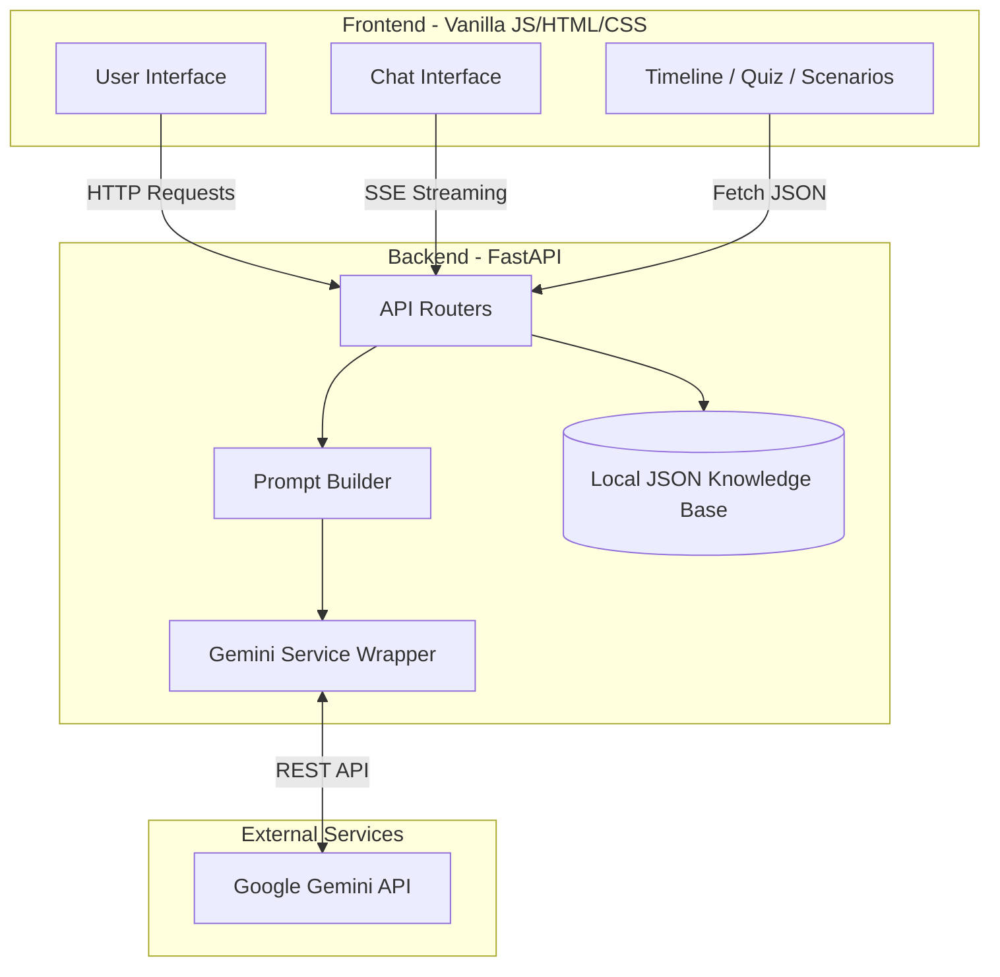
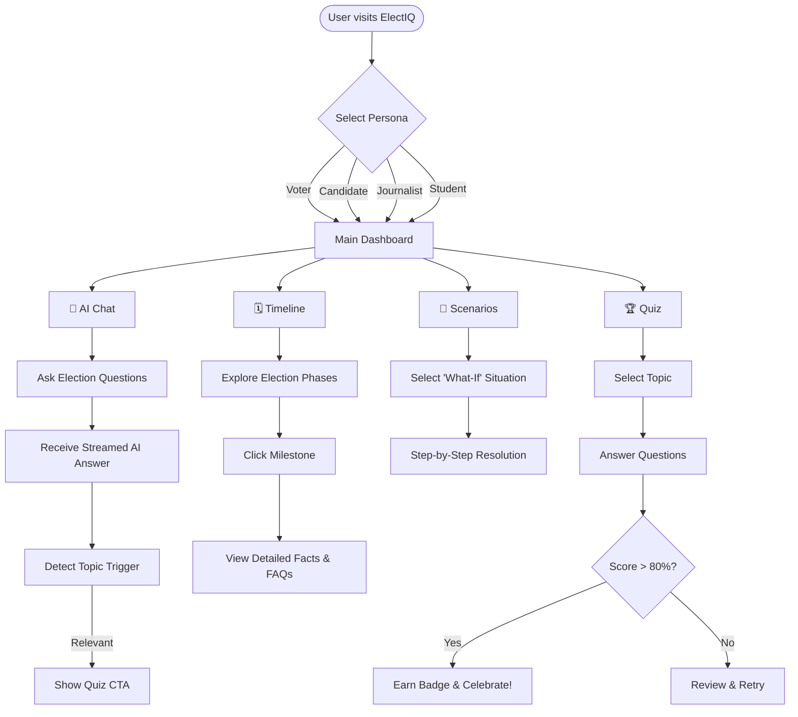

<div align="center">
  <h1>🗳️ ElectIQ</h1>
  <p><strong>Your Election Process Education Assistant</strong></p>
  <p>
    <em>Turning the complex maze of elections into a personalized, conversational, and gamified journey — so every citizen walks in informed and walks out empowered.</em>
  </p>
  <p>
    
    
    
    
    
    
  </p>
</div>

<hr>

## ✨ Features

- 🧠 **AI Chat Assistant** — Gemini-powered, role-aware, streaming responses with official source citations.
- 🗓️ **Interactive Timeline** — Animated election milestones with detailed, slide-in informational panels.
- 🎭 **Role-Based Personalization** — Tailored experiences for First-Time Voters, Candidates, Journalists, and Students.
- 🧩 **Scenario Simulator** — "What If" interactive decision trees for handling common election situations.
- 🏆 **Gamified Quizzes** — 25 questions across 5 topics, featuring a progressive badge system.
- 📊 **Visual Glossary** — Expandable definitions for 10 key electoral terms.
- 🌙 **Dark Mode** — Automatic detection (`prefers-color-scheme`) plus a manual toggle.
- 🇮🇳 **Multilingual Support** — English and Hindi i18n support out-of-the-box.

---

## 🏗️ System Architecture

ElectIQ is built with a lightweight, cloud-native architecture optimized for speed and low cost.



---

## 🚶‍♂️ User Journey Flow



---

## 🚀 Quick Start

### Prerequisites
- **Python 3.11+**
- *(Optional)* Google Gemini API key for full AI chat functionality.

### Local Development

1. **Clone the repository:**
   ```bash
   git clone https://github.com/arpitpandey0307/electiq.git
   cd electiq
   ```

2. **Install dependencies:**
   ```bash
   pip install -r requirements.txt
   ```

3. **Configure Environment Variables:**
   Create a `.env` file in the root directory (this file is ignored by git):
   ```env
   GEMINI_API_KEY=your_gemini_api_key_here
   ALLOWED_ORIGINS=*
   APP_ENV=development
   ```
   > **Note:** If no API key is provided, the app will gracefully fall back to a demo mode with preset responses.

4. **Run the development server:**
   ```bash
   uvicorn backend.main:app --reload --port 8080
   ```
   Navigate to `http://localhost:8080` in your browser.

---

## 🐳 Docker Deployment

ElectIQ is fully containerized using a minimal `python:3.11-slim` base image.

```bash
# Build the image
docker build -t electiq .

# Run the container
docker run -p 8080:8080 -e GEMINI_API_KEY=your_api_key electiq
```

---

## ☁️ Google Cloud Run Deployment

Deploy seamlessly to Google Cloud Run for a scalable, serverless deployment.

```bash
gcloud run deploy electiq \
  --source . \
  --region us-central1 \
  --platform managed \
  --allow-unauthenticated \
  --set-env-vars GEMINI_API_KEY=YOUR_KEY \
  --memory 512Mi \
  --port 8080
```

*Automated deployment is also configured via GitHub Actions in `.github/workflows/deploy.yml` upon pushes to the `main` branch.*

---

## 📁 Project Structure

```text
electiq/
├── backend/
│   ├── main.py              # FastAPI entrypoint
│   ├── routers/             # API endpoint handlers
│   │   ├── chat.py          # /api/chat (SSE streaming)
│   │   ├── timeline.py      # /api/timeline
│   │   ├── quiz.py          # /api/quiz/{topic}
│   │   └── scenarios.py     # /api/scenarios & /api/glossary
│   ├── services/
│   │   ├── gemini_service.py  # Gemini API wrapper
│   │   └── prompt_builder.py  # Role-aware prompts
│   └── data/                # JSON knowledge base
├── frontend/
│   ├── index.html           # SPA shell
│   ├── css/                 # Vanilla CSS design system
│   ├── js/                  # Modular Vanilla JS logic
│   └── assets/              # Translations & static assets
├── Dockerfile               # Container configuration
├── requirements.txt         # Python dependencies
└── .github/workflows/       # CI/CD pipelines
```

---

## 📄 License

This project is licensed under the **MIT License**.

<div align="center">
  <em>Built for informed citizens, designed to win. 🗳️</em>
</div>
