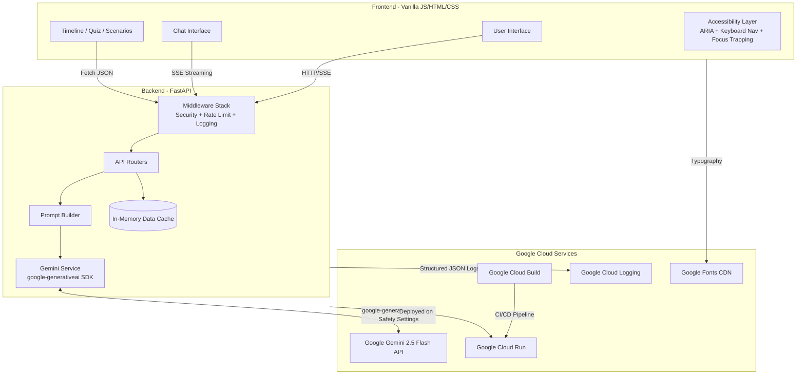

<div align="center">
  <h1>🗳️ ElectIQ</h1>
  <p><strong>Your Election Process Education Assistant</strong></p>
  <p>
    <em>Turning the complex maze of elections into a personalized, conversational, and gamified journey — so every citizen walks in informed and walks out empowered.</em>
  </p>
  <p>
    
    
    
    
    
    
    
    
    
    
    
    
  </p>
</div>

<hr>

## ✨ Features

- 🧠 **AI Chat Assistant** — Google Gemini 2.5 Flash-powered via the official `google-generativeai` SDK, with role-aware system prompts, SSE streaming responses, safety filters, and official source citations.
- 🗓️ **Interactive Timeline** — Animated election milestones with detailed slide-in panels, key facts, FAQ, and focus-trapped accessibility.
- 🎭 **Role-Based Personalization** — Tailored experiences for First-Time Voters, Candidates, Journalists, and Students.
- 🧩 **Scenario Simulator** — "What If" interactive decision trees for handling common election situations.
- 🏆 **Gamified Quizzes** — 25 questions across 5 topics, featuring a progressive badge system with celebrations.
- 📊 **Visual Glossary** — Expandable definitions for 10 key electoral terms with "Dig Deeper" details.
- 🌙 **Dark Mode** — Automatic detection (`prefers-color-scheme`) plus manual toggle with preference persistence.
- 🇮🇳 **Multilingual Support** — English and Hindi i18n support out-of-the-box.
- ♿ **Accessible** — WCAG 2.1 AA compliant: ARIA roles/labels, keyboard navigation, skip links, screen reader support, focus trapping, reduced motion.
- 🔒 **Secure** — OWASP headers (CSP, HSTS, COOP, CORP, X-Frame-Options), rate limiting with LRU eviction, input sanitization, non-root Docker.
- 🧪 **Tested** — Comprehensive pytest suite with **181 tests** across 7 test files covering endpoints, security, models, services, middleware, and data integrity.

---

## 🏗️ System Architecture

ElectIQ is built with a lightweight, cloud-native architecture optimized for speed, security, and low cost.



---

## ☁️ Google Cloud Services Integration

ElectIQ deeply integrates with Google Cloud services across every layer:

| Service | Integration | Details |
|---------|------------|---------|
| **Google Gemini 2.5 Flash** | AI chat engine | Official `google-generativeai` SDK with async streaming, safety filters (harassment, hate, explicit, dangerous), and role-aware system prompts |
| **Google Cloud Run** | Deployment | Serverless container hosting with auto-scaling, health checks, and PORT injection |
| **Google Cloud Build** | CI/CD | Automated test → build → deploy pipeline via `cloudbuild.yaml` |
| **Google Cloud Logging** | Monitoring | Structured JSON logging with severity levels, request IDs, and `google-cloud-logging` SDK integration |
| **Google Fonts** | Typography | Inter + Playfair Display via CDN with `preconnect` and `font-display: swap` optimization |

---

## 🛡️ Security Architecture

| Layer | Protection |
|-------|-----------|
| **Transport** | HSTS with `preload`, Cloud Run managed TLS |
| **Headers** | CSP, COOP, CORP, X-Frame-Options, X-Content-Type-Options, Referrer-Policy, Permissions-Policy, X-Permitted-Cross-Domain-Policies |
| **Input** | Pydantic validation, HTML escaping, length limits, role pattern matching, history entry validation |
| **Rate Limiting** | 30 req/min per IP with LRU eviction (max 10K clients, prevents memory DoS) |
| **AI Safety** | Gemini content filters (harassment, hate, explicit, dangerous) at BLOCK_MEDIUM_AND_ABOVE |
| **Container** | Non-root user, slim base image, no cached packages |
| **Secrets** | Environment variables only, `.env` gitignored |
| **Tracing** | Unique X-Request-ID per request for distributed tracing |

See [SECURITY.md](SECURITY.md) for full details.

---

## 🧪 Testing

ElectIQ includes a comprehensive pytest test suite with **181 tests** across **7 test files** covering:

- ✅ All API endpoints (happy paths + error cases + cache headers)
- ✅ Security headers (CSP, HSTS, COOP, CORP, XSS protection, 12 headers)
- ✅ Input validation (XSS, oversized messages, invalid roles, Unicode, whitespace)
- ✅ Data integrity (quiz answers, dates, uniqueness, explanation quality)
- ✅ Pydantic model constraints and sanitization (all models)
- ✅ Gemini service (fallback responses, keyword matching, streaming)
- ✅ Prompt builder (all roles, edge cases, constants)
- ✅ Middleware (rate limiting, request IDs, timing headers)
- ✅ Configuration (DataCache singleton, logging, constants)
- ✅ Response timing and performance benchmarks

```bash
# Run all tests
pytest -v

# Run with coverage
pytest --cov=backend --cov-report=term-missing

# Run specific test module
pytest tests/test_gemini_service.py -v
```

See [TESTING.md](TESTING.md) for full guide.

---

## ♿ Accessibility (WCAG 2.1 AA)

| Feature | Implementation |
|---------|---------------|
| **Skip Navigation** | Hidden link to main content, visible on focus |
| **Keyboard Navigation** | Arrow keys for tabs (WAI-ARIA Tabs pattern), Enter/Space for cards |
| **Focus Trapping** | Role modal, timeline panel, and badge overlay all trap focus |
| **Focus Restoration** | Focus returns to trigger element on overlay/modal close |
| **ARIA Roles** | `tablist`, `tab`, `tabpanel`, `dialog`, `radiogroup`, `log`, `alert`, `alertdialog` |
| **ARIA States** | `aria-selected`, `aria-checked`, `aria-expanded`, `aria-hidden`, `aria-modal`, `aria-busy` |
| **Screen Reader** | Live region announcements for tab switches, role changes, badges, quiz results |
| **Reduced Motion** | `prefers-reduced-motion` media query disables animations |
| **Semantic HTML** | `<header>`, `<nav>`, `<main>`, `<aside>`, `<time>`, proper heading hierarchy |
| **Chat Timestamps** | `<time>` elements on messages for screen reader context |
| **High Contrast** | CSS variables system supports any color scheme override |

---

## 🚶‍♂️ User Journey Flow


---

## 🚀 Quick Start

### Prerequisites
- **Python 3.11+**
- *(Optional)* Google Gemini API key for full AI chat functionality.

### Local Development

1. **Clone the repository:**
   ```bash
   git clone https://github.com/arpitpandey0307/electiq.git
   cd electiq
   ```

2. **Install dependencies:**
   ```bash
   pip install -r requirements.txt
   ```

3. **Configure Environment Variables:**
   Create a `.env` file in the root directory (this file is ignored by git):
   ```env
   GEMINI_API_KEY=your_gemini_api_key_here
   ALLOWED_ORIGINS=*
   APP_ENV=development
   ```
   > **Note:** If no API key is provided, the app will gracefully fall back to a demo mode with preset responses.

4. **Run the development server:**
   ```bash
   uvicorn backend.main:app --reload --port 8080
   ```
   Navigate to `http://localhost:8080` in your browser.

5. **Run tests:**
   ```bash
   pytest -v
   ```

---

## 🐳 Docker Deployment

ElectIQ is fully containerized with security hardening (non-root user, health checks).

```bash
# Build the image
docker build -t electiq .

# Run the container
docker run -p 8080:8080 -e GEMINI_API_KEY=your_api_key electiq
```

---

## ☁️ Google Cloud Run Deployment

Deploy directly from source to Google Cloud Run:

```bash
gcloud run deploy electiq \
  --source . \
  --region us-central1 \
  --platform managed \
  --allow-unauthenticated \
  --set-env-vars GEMINI_API_KEY=YOUR_KEY \
  --memory 512Mi \
  --port 8080
```

### CI/CD with Google Cloud Build

ElectIQ includes a `cloudbuild.yaml` for automated CI/CD:

```bash
# Trigger a Cloud Build manually
gcloud builds submit --config cloudbuild.yaml
```

The pipeline automatically: runs tests → builds Docker image → pushes to Container Registry → deploys to Cloud Run.

---

## 📁 Project Structure

```text
electiq/
├── backend/
│   ├── __init__.py              # Package with __all__ exports
│   ├── main.py                  # FastAPI entrypoint with middleware stack
│   ├── config.py                # Centralized settings, data cache, logging
│   ├── middleware.py            # Security headers, rate limiting, request logging
│   ├── models.py                # Pydantic request/response models with validation
│   ├── routers/                 # API endpoint handlers
│   │   ├── chat.py              # /api/chat (SSE streaming via Gemini SDK)
│   │   ├── timeline.py          # /api/timeline
│   │   ├── quiz.py              # /api/quiz/{topic}
│   │   └── scenarios.py         # /api/scenarios & /api/glossary
│   ├── services/
│   │   ├── gemini_service.py    # Google Gemini SDK wrapper with fallback
│   │   └── prompt_builder.py    # Role-aware system prompts
│   └── data/                    # JSON knowledge base
├── frontend/
│   ├── index.html               # Accessible SPA shell (WCAG 2.1 AA)
│   ├── css/                     # Design system with a11y utilities
│   ├── js/                      # Modular JS with keyboard navigation
│   └── assets/                  # Translations & static assets
├── tests/
│   ├── conftest.py              # Shared test fixtures
│   ├── test_api_endpoints.py    # API endpoint tests (51 tests)
│   ├── test_security.py         # Security & data integrity tests (30 tests)
│   ├── test_models.py           # Pydantic model validation tests (22 tests)
│   ├── test_gemini_service.py   # Gemini service tests (12 tests)
│   ├── test_prompt_builder.py   # Prompt builder tests (16 tests)
│   ├── test_middleware.py       # Middleware tests (14 tests)
│   └── test_config.py           # Configuration tests (18 tests)
├── Dockerfile                   # Hardened container (non-root, health check)
├── cloudbuild.yaml              # Google Cloud Build CI/CD pipeline
├── pyproject.toml               # Project config & pytest settings
├── requirements.txt             # Runtime + test dependencies
├── SECURITY.md                  # Security policy & measures
└── TESTING.md                   # Testing guide & coverage
```

---

## 📄 License

This project is licensed under the **MIT License**.

<div align="center">
  <em>Built for informed citizens, designed to win. 🗳️</em>
</div>
